# Online Clothes Store

A full-stack local e-commerce application built with:

- Frontend: HTML + CSS + JavaScript + React + Vite
- Backend: Node.js + Express
- Database: MySQL

## Project Structure

```txt
.
|-- backend
|-- frontend
`-- database
```

## Features

- Customer authentication (register/login/profile)
- Admin authentication
- Product and category management
- Cart management
- Order placement and order history
- Simulated payment flow
- Admin reports (sales, categories, top products, low stock, customer purchase summary)

## Local Setup

### 1. Database

1. Create a MySQL database named `online_clothes_store`.
2. Run [database/schema.sql](/c:/Users/91828/OneDrive/Documents/GitHub/Online-Clothes-Store/database/schema.sql).

### 2. Backend

```bash
cd backend
npm install
cp .env.example .env
npm run dev
```

### 3. Frontend

```bash
cd frontend
npm install
npm run dev
```

## Website View

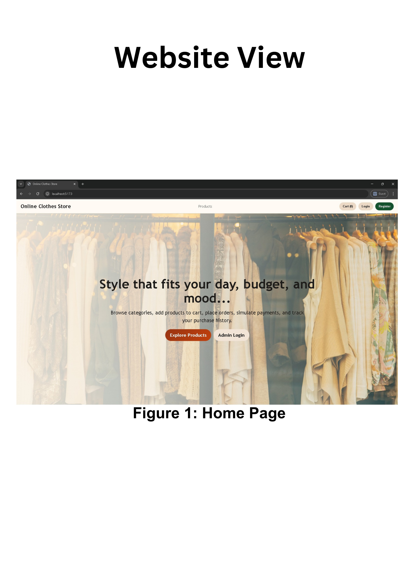
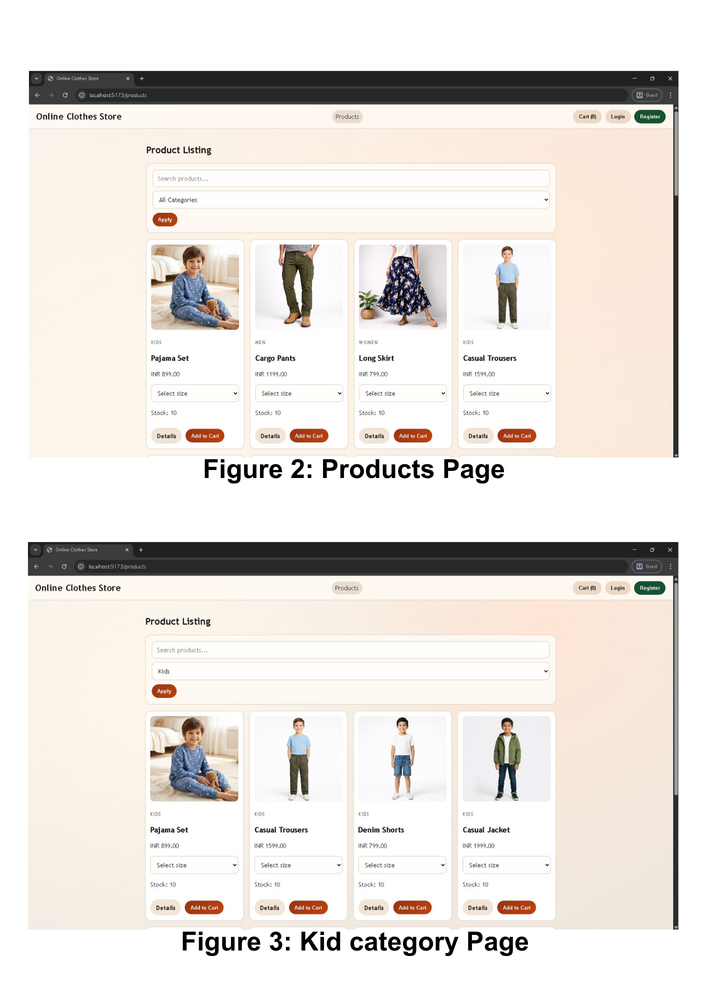
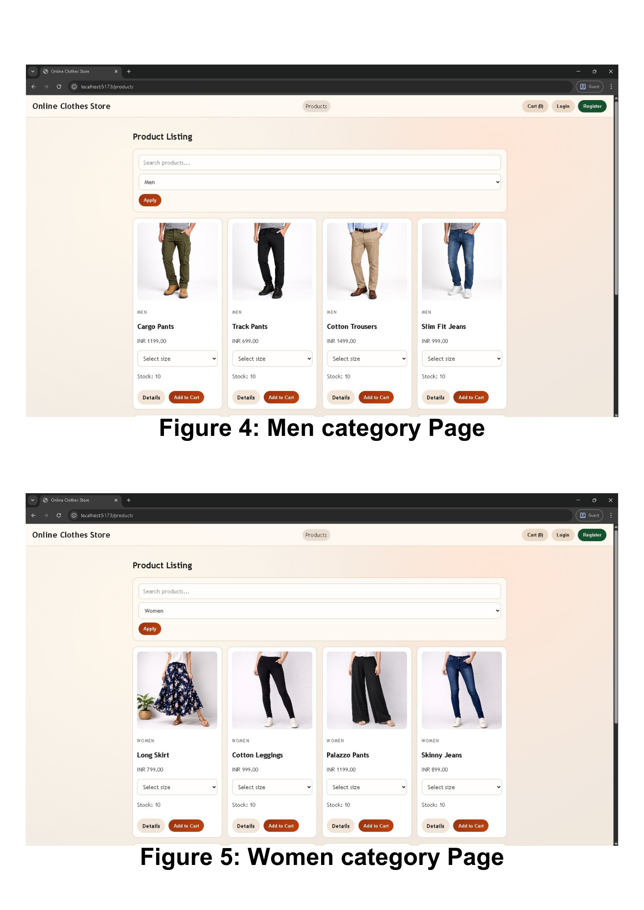
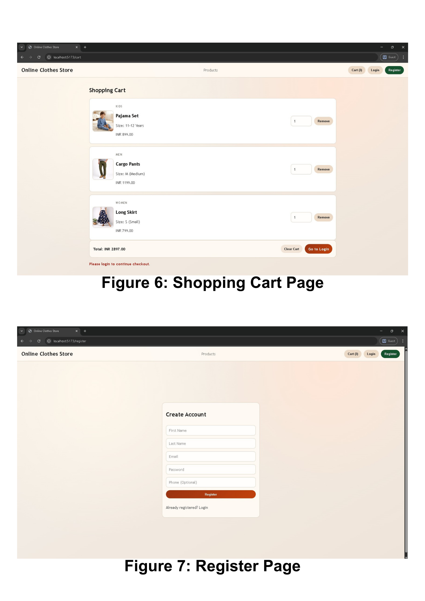
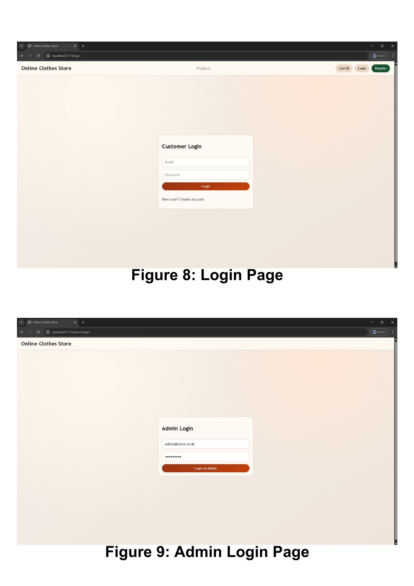


## Customer View

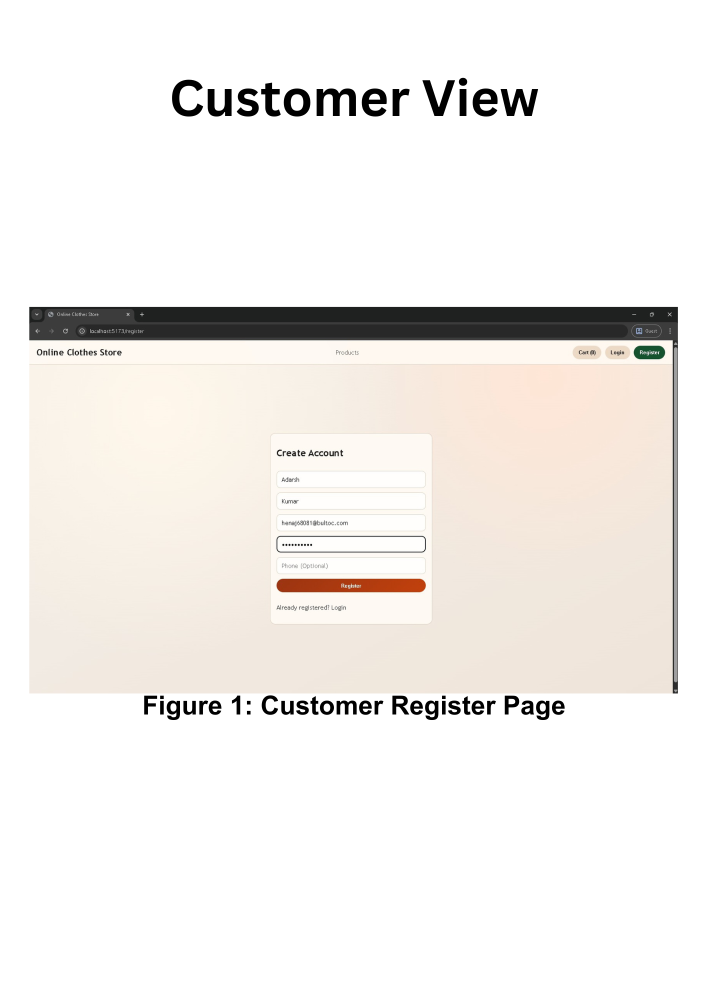
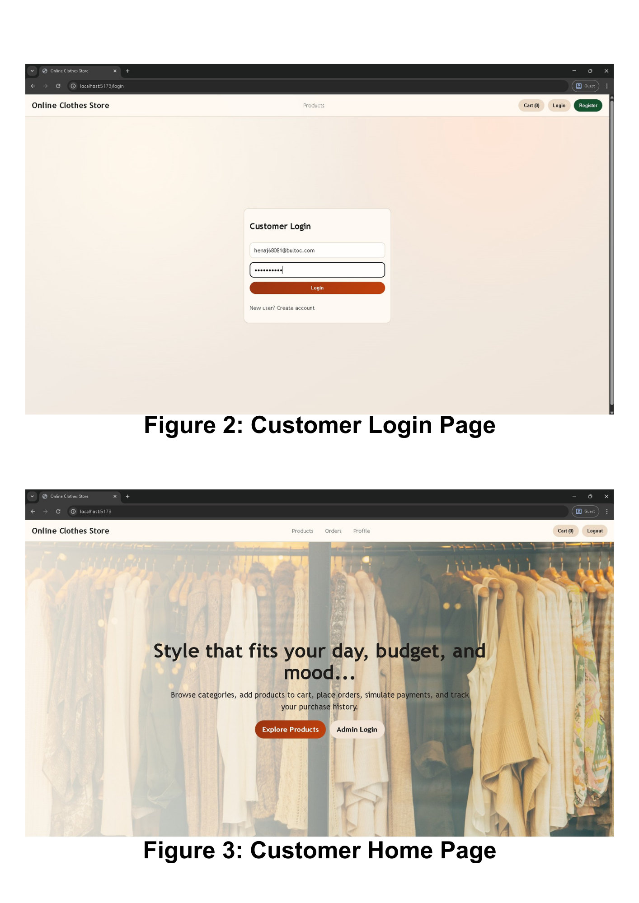
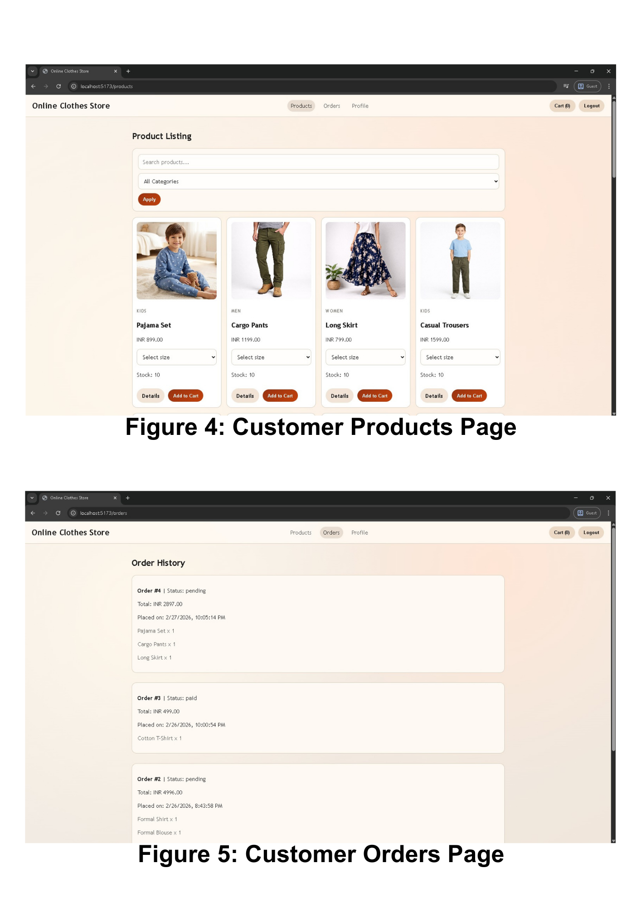
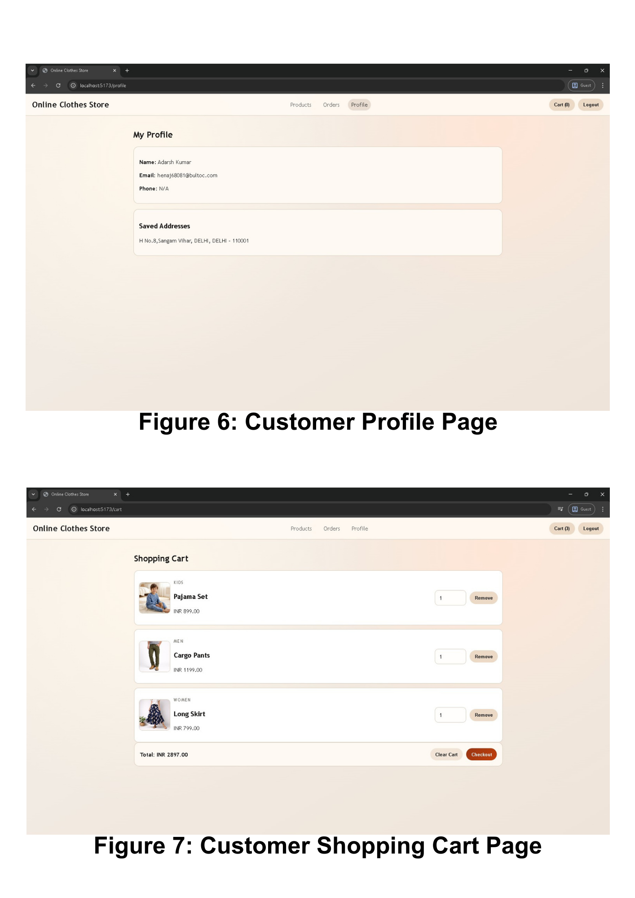
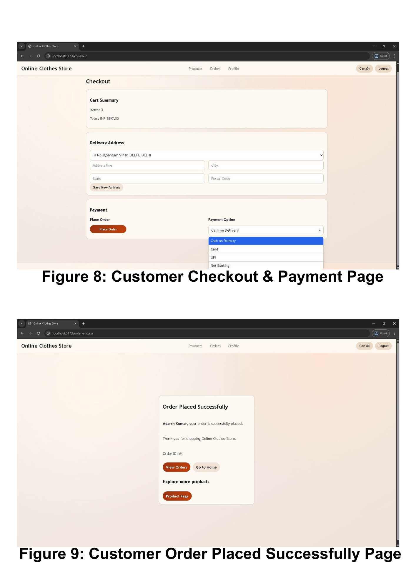


## Admin View

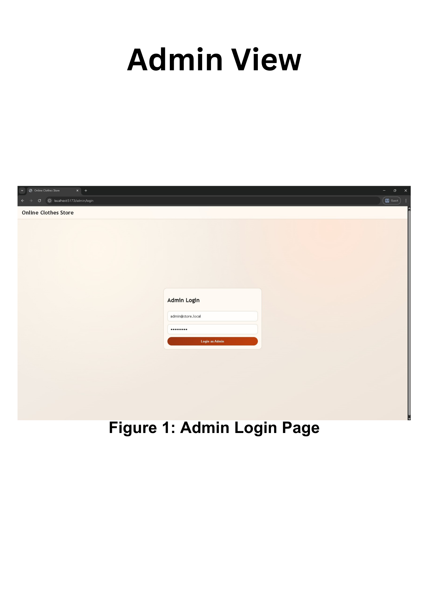
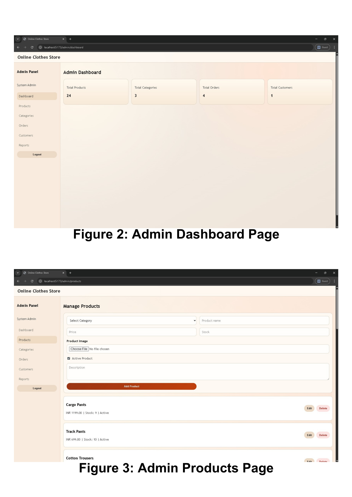
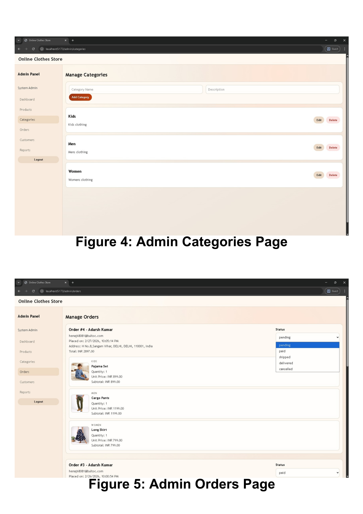
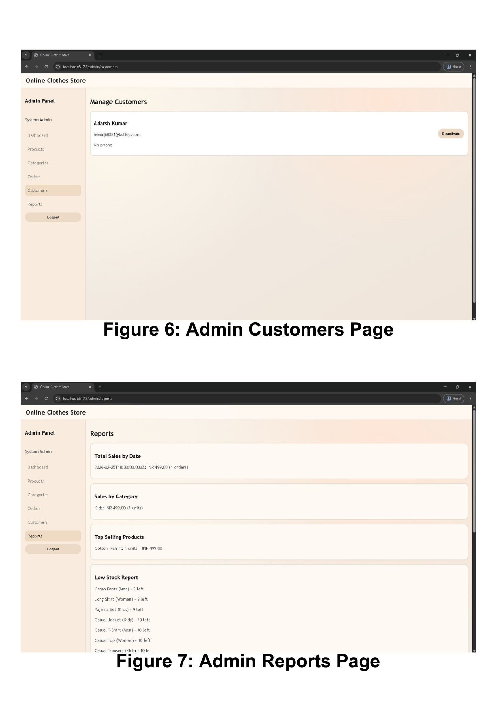


